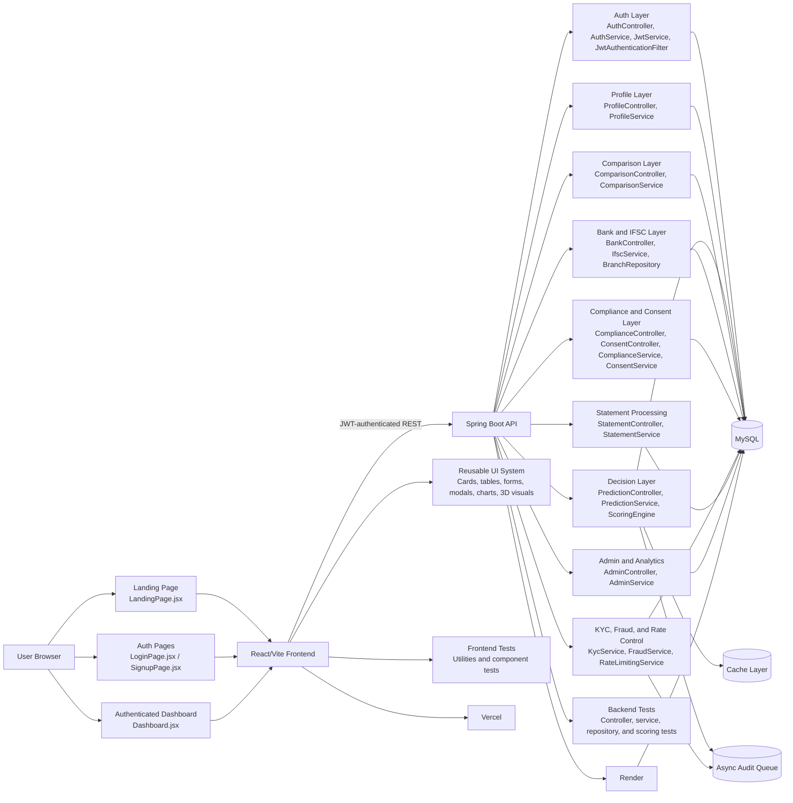

# Testing Branch Detailed Summary

## Purpose of This File

This document explains what has been built in this testing branch, why each part exists, and how the pieces fit together across the frontend, backend, database, authentication, security, integrations, and testing layers. It is written as a working summary for anyone who needs to understand the full shape of the application without reading the entire codebase file by file.

## What This Branch Is For

The main purpose of the branch is to turn the loan discovery application into a complete, secure, testable, production-ready fintech platform. The work done here is not only about adding screens or endpoints. It is about connecting the full user journey end to end:

1. A user lands on the marketing site.
2. The user signs up or logs in.
3. The user completes a profile and loan profile.
4. The system calculates eligibility, EMI, affordability, recommendations, and risk.
5. The user can compare loans, inspect bank data, upload statements, and review compliance information.
6. The backend stores state safely in MySQL and protects sensitive flows with JWT security.
7. Tests verify that the logic, UI, and APIs behave correctly.

That is why the branch touches so many areas. Each module exists to support one part of that end-to-end journey or to protect it.

## High-Level Architecture

The repository is organized as a small full-stack monorepo:

- `loan/` is the React/Vite frontend.
- `backend/` is the Spring Boot API and persistence layer.
- `tools/` contains helper scripts and analysis utilities.
- `PROJECT_DEEP_ANALYSIS.txt` and `PROGRESS.md` document the work and the implementation status.

The architecture is intentionally split so the UI can evolve independently from the API, while still sharing a contract through authenticated HTTP endpoints.

### Architecture Diagram

This diagram shows the actual control flow of the application. The browser enters through the landing, auth, or dashboard screens. The frontend sends authenticated requests to the Spring Boot API. The API then fans out into the different business areas that were added in this branch: identity, profile persistence, loan decisioning, comparison storage, bank data lookup, compliance, risk controls, statement processing, and admin analytics. Those backend layers all converge on MySQL, while the decisioning and auditing flows also use cache and asynchronous processing to stay responsive.

The testing and deployment nodes are shown separately because they are not user-facing features, but they are essential parts of the system. The tests prove the logic is stable, and the deployment targets show how the same app runs in production on Vercel and Render.

## Frontend: What It Does and Why It Exists

The frontend is the user-facing fintech experience. Its job is to make the loan workflow understandable, interactive, and premium-looking while still being practical and responsive.

### Frontend Routes and Pages

These pages define the actual user journey.

- `LandingPage.jsx` exists to introduce the product, explain the value proposition, and drive sign up.
- `LoginPage.jsx` exists so returning users can authenticate and resume their session.
- `SignupPage.jsx` exists so new users can create an account and enter the platform.
- `Dashboard.jsx` exists as the authenticated workspace where the user does the real loan work.
- `DecisionHistory.jsx` exists so users can review previously generated decisions and audit the history of their activity.
- `AboutPage.jsx` exists to explain the app and the product story.
- `ContactPage.jsx` exists so users can reach support or sales/contact details.
- `PrivacyPage.jsx` exists to explain privacy and data handling expectations.

### Core Frontend Components

These components are the visible building blocks of the application.

- `Navbar.jsx` exists to provide global navigation and route access.
- `Footer.jsx` exists to give the app a consistent ending section and supporting links.
- `Hero3D.jsx` exists to make the landing page feel visually distinctive and modern.
- `ScrollMorphHero.jsx` exists to create an animated hero experience that makes the first impression feel premium.
- `InteractiveRatesSection.jsx` and `InteractiveRateCard.jsx` exist to present loan rate information in an interactive, easy-to-scan format.
- `LoanCard.jsx` exists to show individual loan offerings in a structured form.
- `RecommendationCard.jsx` exists to explain which loan options fit best and why.
- `ComparisonTable.jsx` exists so users can compare multiple loans side by side.
- `EMICalculator.jsx` exists to calculate monthly repayment values and help users understand affordability.
- `EligibilityResult.jsx` exists to show whether a user qualifies and to explain the outcome.
- `RiskGauge.jsx` exists to visualize the risk or score output in a way that is fast to understand.
- `ReasonList.jsx` exists to show the reason strings behind a decision so the result is explainable.
- `LoanIntelligenceCard.jsx` exists to combine scoring, eligibility, EMI, and reason output into one decision-focused card.
- `IfscLookup.jsx` exists to let users look up bank branch and IFSC information.
- `StatementUpload.jsx` and `UploadZone.jsx` exist to support statement ingestion and document-based financial analysis.
- `ComplianceHub.jsx` exists to surface data rights, consent history, and compliance actions.
- `KfsModal.jsx` exists to present the Key Fact Statement and cooling-off acknowledgement before application steps continue.
- `ThemeToggle.jsx` exists to let users switch appearance modes.
- `DashboardTabs.jsx` exists to organize the dashboard into clear working areas.
- `FormWrapper.jsx` exists to keep forms visually consistent and reusable.
- `ProfileForm.jsx` and `LoanForm.jsx` exist to collect the user profile and loan details needed for scoring and persistence.
- `RiskGauge.jsx`, `CashflowChart.jsx`, and `EMICalculator.jsx` exist to turn financial data into visuals that users can interpret quickly.
- `RecommendationCard.jsx` exists to connect analysis output to action.
- `LoanIntelligenceCard.jsx` exists to unify the most important decision logic in one place.

### Shared UI Primitives

These components exist so the UI stays consistent instead of being built as one-off screens.

- `Button.jsx`, `AnimatedButton.jsx`, and `ThemeToggle.jsx` exist to standardize interaction styles.
- `Alert.jsx` exists to show status, warnings, and errors clearly.
- `Badge.jsx` exists to label statuses and categories.
- `Card.jsx`, `PremiumCard.jsx`, and `StatCard.jsx` exist to package content into reusable panels.
- `Input.jsx`, `Label.jsx`, `Select.jsx`, and `FormField.jsx` exist to build forms consistently.
- `Modal.jsx` exists to handle gated dialogs like KFS and other blocking flows.
- `DataTable.jsx` exists for tabular data such as comparison and history views.
- `LoadingState.jsx`, `Spinner.jsx`, and `EmptyState.jsx` exist to make async and empty views understandable instead of broken or blank.
- `SectionHeader.jsx` and `PageContainer.jsx` exist to keep page structure aligned across the app.
- `Tabs.jsx` exists to organize dashboard content into separate functional areas.

### Visual and Motion System

The styling and motion work exist for a reason: fintech software should feel trustworthy, clear, and professional, not generic.

- `Hero3D.jsx`, `EMIDonut3D.jsx`, `FinancialCore.jsx`, and `ThemeParticles.jsx` exist to add depth and motion to the most visible parts of the product.
- `ScrollMorphHero.jsx` exists to make the landing experience feel intentional instead of static.
- Framer Motion and the animation patterns in dashboard components exist to make state changes feel polished and to reduce the sense of a hard, abrupt interface.
- Tailwind-based styling exists so the layout system is fast to iterate on while staying responsive.

### Frontend Data and Utility Layer

These files exist so the UI is not doing business logic directly.

- `loan/src/services/predictionApi.js` exists to centralize authenticated calls to the decision APIs.
- `loan/src/utils/api.js` exists to abstract general API access.
- `loan/src/utils/eligibility.js` exists to keep eligibility calculations reusable and testable.
- `loan/src/utils/emiCalculator.js` exists to calculate EMI values in a pure and verifiable way.
- `loan/src/utils/formatters.js` exists to present money, percentages, and related values consistently.
- `loan/src/utils/recommendations.js` exists to translate profile inputs into loan recommendation logic.
- `loan/src/data/bankData.js` exists to store structured bank-related reference data.
- `loan/src/data/loanTypes.js` exists to keep loan category information centralized.

### Frontend Auth and Session Handling

Authentication on the frontend exists so protected pages are only available to signed-in users and so the app can keep track of the current session.

- JWT tokens are stored in browser storage so the session survives page refreshes.
- Protected routing exists so dashboard content is not shown to anonymous users.
- The login and signup pages exist to create and re-establish authenticated state.
- The frontend uses the configured admin email to decide whether admin UI elements should be visible.

## Backend: What It Does and Why It Exists

The backend is the trusted application layer. It stores data, applies rules, secures access, and acts as the source of truth for the frontend.

### Application Entry and Configuration

- `LoanDiscoveryApplication.java` exists as the Spring Boot entry point.
- `WebConfig.java` exists to configure web behavior such as CORS and related HTTP settings.
- `SecurityConfig.java` exists to define who can call which endpoints and how requests are authenticated.
- `CacheConfig.java` exists to make repeated reads faster and reduce unnecessary database traffic.
- `AsyncConfig.java` exists to support asynchronous work without slowing down the main request thread.
- `DataSeeder.java` exists to seed reference data and support repeatable local or initial setup.

### Authentication and Identity

These files exist because the app needs a secure way to know who the user is.

- `AuthController.java` exists to handle register and login requests.
- `AuthService.java` exists to perform the actual registration and authentication logic.
- `JwtService.java` exists to generate and validate JWTs.
- `JwtAuthenticationFilter.java` exists to read tokens from requests and populate the authenticated security context.
- `CurrentUserService.java` exists to resolve the active user from the request context.
- `AuthenticatedUser.java` exists to represent authenticated user information in a safe way.
- `RegisterRequest.java`, `LoginRequest.java`, `LoginResponse.java`, and `AuthUserResponse.java` exist to structure auth input and output data.

The purpose of this layer is to avoid exposing raw user identity from the client and to ensure the backend decides who the request belongs to.

### Profile and User Data

These files exist so users can save personal and loan information between sessions.

- `ProfileController.java` exists to expose profile save and load endpoints.
- `ProfileService.java` exists to own the profile business logic.
- `PersonalProfileRepository.java` and `LoanProfileRepository.java` exist to persist profile records.
- `PersonalProfileRequest.java`, `LoanProfileRequest.java`, and `ProfileResponse.java` exist to define the data contract for profile operations.
- `PersonalProfile.java`, `LoanProfile.java`, and `User.java` exist to represent the stored entities and user record.

### Decision, Scoring, and Prediction Logic

These files exist because the app needs a deterministic loan decision engine.

- `PredictionController.java` exists to expose the decision endpoints.
- `PredictionService.java` exists to orchestrate scoring, audit, and idempotency behavior.
- `ScoringEngine.java` exists to compute the risk score and lending outcome from the input factors.
- `PredictionRequest.java` and `PredictionResponse.java` exist to carry the request and response data.
- `LoanDecision.java` exists as the audit snapshot entity for each decision.
- `LoanDecisionRepository.java` exists to store and query those decisions.

The purpose of this part of the backend is to make the decision flow reproducible and explainable. It is not enough to say yes or no; the app needs to show the score, band, max eligible amount, and reason details.

### Comparison and Loan Discovery

These files exist so users can compare options and keep track of them.

- `ComparisonController.java` exists to manage comparison CRUD operations.
- `ComparisonService.java` exists to implement the comparison logic.
- `SavedComparisonRepository.java` exists to persist the saved comparison records.
- `SavedComparison.java` exists to represent a stored comparison.
- `SaveComparisonRequest.java` and `SavedComparisonResponse.java` exist to define the API contract.

### Bank, IFSC, and Market Data

These files exist so users can explore banking data without leaving the application.

- `BankController.java` exists to expose bank search and branch lookup APIs.
- `IfscService.java` exists to resolve IFSC information.
- `IfscResponse.java` exists to return the lookup result in a structured form.
- `BranchRepository.java` exists to query branch data.
- `Branch.java` exists to represent branch records.
- `GlobalMarketController.java` exists to serve market hotspot data.
- `GlobalMarketService.java` exists to manage the market hotspot logic.
- `GlobalMarketHotspotResponse.java` exists to shape the market response payload.

The reason these exist is that loan discovery is not only about one user profile. It also depends on bank availability, branch intelligence, and market context.

### Compliance, Consent, and Consumer Protection

These files exist because a fintech app needs explicit user rights handling and consent tracking.

- `ComplianceController.java` exists to expose data export and deletion operations.
- `ComplianceService.java` exists to compile data, handle deletion, and enforce rights workflows.
- `ConsentController.java` exists to manage consent actions.
- `ConsentService.java` exists to record and interpret consent events.
- `UserConsent.java` exists to persist consent history.
- `ComplianceHub.jsx` on the frontend exists to show the user those rights in a visible dashboard area.
- `KfsModal.jsx` exists to present key facts before the user proceeds.

The purpose of this layer is to support data rights, informed consent, and consumer protection instead of treating them as afterthoughts.

### KYC, Fraud, and Risk Controls

These files exist to reduce obvious abuse and unsupported claims.

- `KycController.java` exists to manage KYC-related API flows.
- `KycService.java` exists to support OTP and PAN-style verification logic.
- `FraudController.java` exists to expose fraud review or internal alert endpoints.
- `FraudService.java` exists to flag suspicious patterns such as impossible income, bursts, repeated failures, and abnormal jumps.
- `FraudAlert.java` exists to persist suspicious events.
- `FraudAlertRepository.java` exists to query those alerts.
- `OtpRecordRepository.java` and `OtpRecord.java` exist to store OTP cycles.

These controls exist because lending systems need baseline trust signals and guardrails even in a mock or development environment.

### Statement Processing

These files exist to support bank statement ingestion and cashflow analysis.

- `StatementController.java` exists to accept statement-related requests.
- `StatementService.java` exists to process the statement input and derive useful financial information.
- `StatementReportRepository.java` and `StatementReport.java` exist to store processed statement output.
- `StatementUpload.jsx`, `UploadZone.jsx`, and `CashflowChart.jsx` on the frontend exist to make the upload and result flow usable.

The purpose of statement processing is to move beyond static form inputs and allow richer financial evidence.

### Admin and Operational Insight

These files exist so the app can show platform-level status and aggregate usage.

- `AdminController.java` exists to expose admin statistics.
- `AdminService.java` exists to calculate and return those stats.
- `AdminStatsResponse.java` exists to carry the admin payload.

This exists so the platform can surface operational metrics instead of being a black box.

### Async, Cache, and Rate Control

These files exist to make the app more stable under load.

- `AsyncAuditService.java` exists to move audit logging away from the main request path.
- `RateLimitingService.java` exists to prevent abuse and limit rapid repeated requests.
- `CacheConfig.java` exists to support caching for repeated reads.

The purpose of these layers is to reduce latency, avoid database pressure, and keep the system more resilient.

### Error Handling and API Safety

- `GlobalExceptionHandler.java` exists to turn internal exceptions into safe responses.
- Its job is to hide stack traces from users, normalize conflict cases, and keep error responses consistent.

## Database and Persistence: What It Does and Why It Exists

The database layer exists to make the app stateful and auditable.

### Why MySQL Is Used

The backend is intentionally MySQL-only in the intended runtime setup. That choice exists because the application depends on a real persistent relational store for users, profiles, decisions, comparisons, consents, fraud alerts, OTPs, and reports. The design does not rely on an in-memory fallback.

### Main Persisted Concepts

- `User` exists to store authentication and identity data.
- `PersonalProfile` exists to store the user’s personal financial context.
- `LoanProfile` exists to store the user’s loan preferences and loan-related inputs.
- `SavedComparison` exists to store saved product comparisons.
- `LoanDecision` exists to store the immutable audit snapshot of a decision.
- `UserConsent` exists to store consent history.
- `FraudAlert` exists to store suspicious signal records.
- `OtpRecord` exists to store OTP verification cycles.
- `StatementReport` exists to store statement analysis results.
- `Branch` exists to store bank and branch reference data.

### Why These Tables Matter

These entities exist because the product is not just a stateless calculator. It needs to remember what the user entered, what the system returned, when it returned it, and what consent or risk state was involved. That persistence is what makes the platform auditable and useful over time.

## Authentication: What It Does and Why It Exists

Authentication exists so the platform can protect user data and make all private flows belong to a specific user.

### Backend Authentication Flow

1. The user registers or logs in through `AuthController`.
2. `AuthService` verifies credentials and creates the identity record or token response.
3. `JwtService` signs the token.
4. `JwtAuthenticationFilter` reads the token on protected requests.
5. `CurrentUserService` resolves the active user for the request.
6. Protected services then use that identity instead of trusting a client-supplied user ID.

### Why This Design Was Chosen

The point of JWT-based auth here is not just login convenience. It is to avoid exposing user ownership in the frontend payload and to keep profile, comparison, decision, and compliance data scoped to the authenticated user only.

## Security: What It Does and Why It Exists

Security is built into the branch because the domain is financial and sensitive.

### Security Features Implemented

- JWT-based protected routes and backend endpoints.
- BCrypt password hashing.
- Sanitized error handling through `GlobalExceptionHandler`.
- Idempotency protection for decision requests.
- Unique database constraints to avoid duplicate writes.
- User-scoped repository queries to prevent cross-account access.
- Rate limiting to prevent request abuse.
- CORS configuration to limit which frontend origins can call the API.
- PII-aware logging choices in the audit flow.
- Consent and compliance endpoints for user data rights.

### Why These Controls Exist

These measures exist because financial applications must be careful with identity, data exposure, and repeated submissions. The branch is deliberately designed to prevent easy abuse, reduce accidental leakage, and make user actions traceable.

## Testing: What It Does and Why It Exists

Testing exists so the branch can be trusted rather than only visually inspected.

### Backend Tests

The backend test suite covers the business-critical logic and API behavior.

- `PredictionControllerTest` exists to verify the protected decision endpoints.
- `PredictionServiceIdempotencyTest` exists to confirm repeated submissions are handled correctly.
- `LoanDecisionRepositoryTest` exists to validate database query behavior.
- `ScoringEngineTest` exists to verify the lending score calculations.

These tests exist because the lending logic must not drift silently.

### Frontend Tests

The frontend tests exist to ensure the user-facing calculations and visuals still behave as expected.

- `emiCalculator.test.js` exists to verify EMI math.
- `eligibility.test.js` exists to verify eligibility logic.
- `formatters.test.js` exists to verify user-facing formatting.
- `LoanIntelligenceCard.test.jsx` exists to check the loan intelligence UI behavior.
- `LoanDecisionVisuals.test.jsx` exists to check the visuals tied to decision output.

### Why Testing Was Done

Testing was added because the app contains both financial logic and UI state. A change can break either the math or the presentation. The test layer exists to catch that before a user sees it.

## Integration Work: What It Does and Why It Exists

Integration work exists to connect the frontend, backend, and external-style flows into a single product.

### Frontend to Backend Integration

- The frontend API layer exists to call the backend with JWT attached.
- Protected dashboard views exist to fetch private profile and decision data.
- Decision history exists to show records returned from backend persistence.
- Recommendation and comparison views exist to consume backend output and display it back to the user.

### Mock or Staged External Integrations

- KYC and OTP logic exists to simulate real verification integrations.
- PAN verification logic exists to prepare for third-party identity validation.
- Bank statement processing exists to support future financial data providers.
- Fraud heuristics exist to simulate a future fraud bureau integration.
- Market hotspot enrichment exists to combine live macro context with stored seed data.

### Why Integration Work Was Done

A loan platform is only valuable if the pieces talk to each other. The branch work exists to make the frontend, backend, and future external services look and behave like one system.

## Deployment and Environment Setup

Deployment support exists so the app can run outside local development.

### Backend Deployment

- `render.yaml` exists to define the backend service deployment shape.
- The backend environment variables exist to keep secrets out of source control.
- The app is designed to run on Render with a real MySQL backend.

### Frontend Deployment

- `vercel.json` exists so React Router routes work as a single-page application on Vercel.
- `VITE_API_BASE_URL` exists so the deployed frontend can talk to the deployed backend.

### Why This Was Done

The deployment configuration exists so the app can move from local testing to actual hosting without rewriting the app architecture.

## What We Have Effectively Done in This Branch

In plain language, this branch has done the following:

- Built the loan discovery platform as a full-stack product.
- Created the core authentication flow.
- Added protected profile, loan, comparison, and decision workflows.
- Added loan scoring, eligibility, EMI, and recommendation logic.
- Added a premium frontend with reusable components and visual polish.
- Added bank lookup, IFSC lookup, market data, statement, compliance, KYC, fraud, and admin features.
- Added MySQL-backed persistence for important user and audit data.
- Added security, caching, async auditing, and rate limiting for stability.
- Added backend and frontend tests so the work can be verified.
- Added deployment notes and config so the project can run in real environments.

## Why This Work Matters

The purpose of all this work is to make the platform useful as a real loan decision experience instead of a simple demo.

- Frontend work matters because it shapes the user journey and makes the product understandable.
- Backend work matters because it secures the data and enforces the rules.
- Database work matters because the app must remember user state and decisions.
- Security work matters because the app handles financial and personal data.
- Testing matters because the system cannot be trusted if the calculation and access rules are not verified.
- Integration work matters because all features need to function together as one product.

## Current Validation Status

The repository documentation indicates that the backend compile and frontend build have been validated locally during development. That means the current branch is not just conceptual work; it has been checked with real build steps.

## Closing Summary

This branch is a full implementation pass for a secure loan discovery application. It covers the user interface, authentication, decisioning, persistence, compliance, risk controls, reporting, and testing layers. The reason each part exists is simple: to make the app function as a real financial product that can guide users, protect data, and explain its decisions.
